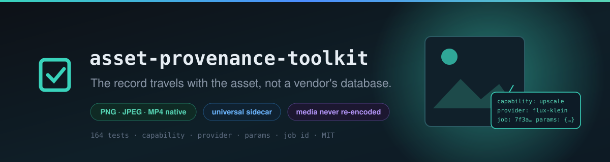
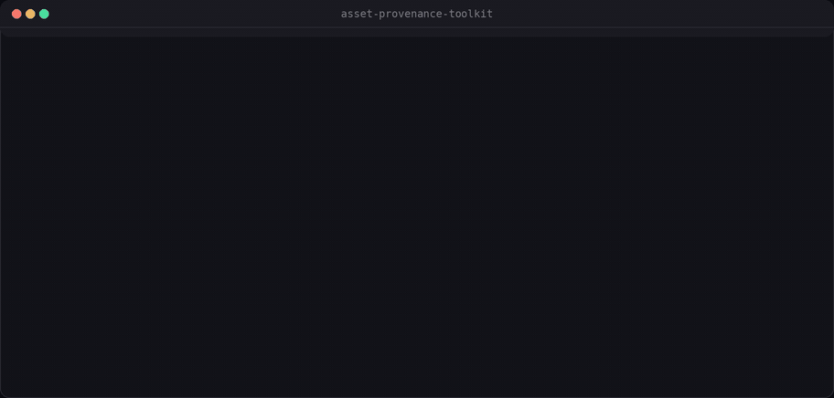
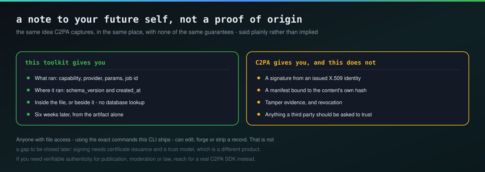

# asset-provenance-toolkit

Embed and extract generation provenance — capability, provider, params, job id — directly in the files an AI pipeline produces, so the record travels with the asset instead of living only in a database row. A provider-agnostic generalization of the classic "drag the PNG back into the UI to see its generation parameters" pattern (AUTOMATIC1111, ComfyUI), applicable to any file and any generation backend.



<sub>Real output. The PNG is written, the provenance is embedded into it, and <code>aprov extract</code> reads it back out of the same file — no database in the loop.</sub>

Part of the same small ecosystem as [`ai-job-gateway`](https://github.com/Furkiozknn/ai-job-gateway), [`prompt-template-manager`](https://github.com/Furkiozknn/prompt-template-manager), and [`model-comparison-harness`](https://github.com/Furkiozknn/model-comparison-harness) — coupled only through documented HTTP contracts, never through a shared Python dependency.

## Why

A generated image or video is only as reproducible as the metadata that survives alongside it. Once a file leaves the system that made it — downloaded, shared, archived — there's usually no way to know what produced it: which model, which provider, which parameters, which prompt. `ai-job-gateway`'s job records answer that question, but only for as long as the job hasn't expired out of the store (`result_expires_at`, see ADR-005). This tool makes provenance an attribute of the *file itself*, so it survives independently of any database or job store's retention window.

## What it does

- **Embed** a `Provenance` record (capability, provider, params, optional job id / source URL / result / arbitrary `extra` fields) into a file — natively for PNG, JPEG and the MP4/QuickTime family, via a sidecar for anything else.
- **Extract** it back out, as JSON.
- **Verify** whether a file has provenance, with a scriptable exit code (or `--json` for machine-readable output).
- **Strip** it, when you want to publish a file without its generation history attached.
- **`from-job`**: fetch a finished job directly from a running `ai-job-gateway`-compatible server and embed its record in one step.

## Quickstart

```bash
uv sync --group dev

uv run aprov embed cat.png --capability image-generate --provider flux-2 \
    --params '{"prompt": "a red sneaker on a white background", "seed": 42}'
# embedded provenance into cat.png (png backend)

uv run aprov extract cat.png --compact
# {"capability":"image-generate","created_at":"2026-09-02T12:00:00+00:00", ...}

uv run aprov verify cat.png
# OK: cat.png has provenance (capability='image-generate', provider='flux-2', ...)
```

`cat.png` now carries its own generation history. Copy it, rename it, send it to someone else — `aprov extract cat.png` still works, with no database or job id lookup involved.

## Backends


| File type | Backend | How |
|---|---|---|
| `.png` | native | An `ai-provenance` chunk spliced in just before `IEND` — `tEXt` normally, `zTXt` (zlib-compressed, the same tradeoff ComfyUI makes for its embedded workflow JSON) once the record passes ~2 KB. The file is edited as a sequence of chunks and never decoded: `IDAT` and every other chunk, including other tools' text chunks, are copied byte for byte — genuinely lossless. |
| `.jpg` / `.jpeg` | native | A private APP1 marker segment (tagged `AIPROV1\0`, distinct from EXIF's `Exif\0\0` or XMP's URI tag so it can never collide with either) spliced directly into the file's marker structure. Unlike the PNG backend, this never decodes or re-encodes the image — JPEG recompression is lossy, so this backend edits container bytes only, leaving every other byte (including all scan/pixel data) untouched. Capped at ~64 KB of provenance JSON per file, since a single marker segment's length field is 2 bytes; `embed` raises a clear error rather than silently truncating if a record is that large. |
| `.mp4` / `.m4v` / `.m4a` / `.mov` | native | A `uuid` box — the ISO base media format's own extension point for private data, the same mechanism XMP uses — tagged with this tool's own UUID and **appended after the media data**. Nothing before the end of `mdat` ever moves, because `stco`/`co64` hold *absolute file offsets* into it; shift those by even one byte and the file still parses, still reports the right duration, and no longer decodes. Any edit that would have to relocate bytes inside that protected region is refused rather than performed. |
| anything else | sidecar | A `<file>.provenance.json` file next to the asset. |

`extract()` always checks the sidecar as a fallback, even for PNG/JPEG — a sidecar can legitimately exist next to an image whose embedded record was stripped by some other tool along the way.

Every backend writes the new bytes to a temporary file beside the original and renames it into place, so an interrupted write (disk full, killed process) leaves the original file as it was, never half-written. The original's permission bits are kept, and a symlink is followed rather than replaced. A record that cannot be read — bytes that are not UTF-8, a field of the wrong JSON type — is reported as `error: ...` by the CLI, not as a Python traceback.

Video is where a sidecar hurts most, which is why the MP4 backend exists: a generated clip is the asset most likely to leave as a single file — uploaded, re-shared, dropped into an edit — and a `.provenance.json` next to it survives none of that.

It is also the backend with the sharpest failure mode, and worth spelling out. Inserting metadata near the front of an MP4, the way the JPEG backend does, produces a file that passes every structural check and decodes to nothing — on an `ffmpeg`-encoded clip, `ffprobe` still reports the correct codec and duration while decoding dies on the first frame with `Invalid NAL unit size`. The suite keeps that insert as a negative control: it performs it and asserts that the chunk offset in `stco` now lands on different bytes, right next to the tests that prove the real path leaves that offset pointing where it did.

WebM/Matroska is a genuinely different container (EBML, not ISO base media) and still falls back to the sidecar.

## Relationship to C2PA / Content Credentials



[C2PA](https://c2pa.org/) ("Content Credentials") is the industry standard for *cryptographically signed, tamper-evident* provenance: a manifest is bound to the asset's content hash and signed with an X.509 certificate, so a viewer can verify the credential wasn't altered and trace it to a specific signing identity, and browsers/platforms are increasingly built to surface that signature. This toolkit deliberately does **not** implement any of that. Signing requires certificate issuance and a trust model — a genuinely different, heavier product than a CLI a solo pipeline drops into its output step — and claiming C2PA compatibility without one would be actively misleading.

What this toolkit gives you is the same *idea* a C2PA assertion captures (what tool, what parameters, what job produced this asset) in the same *place* (inside or next to the file), with none of the same *guarantees*: no signature, no content-hash binding, no tamper detection, no revocation. Think of an `ai-provenance` record as a structural cousin of one C2PA assertion, not a substitute for a C2PA manifest. If a project genuinely needs verifiable, hard-to-forge authenticity claims — for publication, moderation, or legal purposes — reach for a real C2PA SDK. Use this toolkit for the far more common internal case: "I want to know what I ran to produce this file, six weeks from now, without a database lookup."

## CLI usage

```bash
# Embed provenance manually
aprov embed output.png --capability image-generate --provider flux-2 \
    --params '{"prompt": "a red sneaker on a white background", "seed": 42}' \
    --extra '{"steps": 30, "cfg_scale": 7.5}'

# Dispatch is by extension - this works exactly the same way on a JPEG
aprov embed output.jpg --capability image-generate --provider flux-2 \
    --params '{"prompt": "a red sneaker"}'

# ...and on video: the record goes into the container, the frames are untouched
aprov embed clip.mp4 --capability video-generate --provider mock-video \
    --params '{"prompt": "a red sneaker rotating", "seed": 42}'
# embedded provenance into clip.mp4 (mp4 backend)

# Extract it back out
aprov extract output.png
# {
#   "capability": "image-generate",
#   ...
# }

# Check whether a file has provenance (exit 0/1, scriptable)
aprov verify output.png
aprov verify output.png --json   # {"ok": true, "file": "output.png", "provenance": {...}}

# Remove it before publishing/sharing
aprov strip output.png

# Fetch a finished job from a running ai-job-gateway server and embed it in one step
aprov from-job output.png --gateway-url http://localhost:8000 --job-id <job-id>
```

## Library usage

```python
from asset_provenance_toolkit import Provenance, embed, extract, strip

provenance = Provenance(
    capability="image-generate",
    provider="flux-2",
    params={"prompt": "a red sneaker", "seed": 42},
)
embed("output.png", provenance)   # unchanged for "output.jpg", "clip.mp4", "clip.mov"

found = extract("output.png")
assert found.provider == "flux-2"

strip("output.png")
```

## The provenance schema

A small, deliberately stable JSON shape (`schema_version: 1`) — this is data meant to remain readable years after it was written, long after any job record it references has expired out of a gateway's store:

```json
{
  "schema_version": 1,
  "capability": "image-generate",
  "provider": "flux-2",
  "params": {"prompt": "a red sneaker", "seed": 42},
  "job_id": "job-abc123",
  "source": "ai-job-gateway",
  "source_url": "http://localhost:8000",
  "created_at": "2026-08-31T12:00:00+00:00",
  "result": {"...": "..."},
  "extra": {}
}
```

Add new fields through `extra`, not by changing what an old file already has embedded — a v1 reader must always be able to parse a v1 record; a record from a newer schema version is rejected with a clear error rather than silently misread.

## Testing

```bash
uv run pytest -v
```

157 tests, no network and no external binaries — the MP4 fixtures are ISO base media files the suite builds itself, which is what lets the chunk-offset assertions name an exact byte.

There is one check that deliberately does need a binary, and it is the one worth running before trusting the video path:

```bash
uv run python arac/gercek-video-dogrula.py
```

It encodes real clips with `ffmpeg` (both box layouts, a `.mov`, an audio-only `.m4a`), embeds a record into each, and compares the sha256 of the **decoded** output before and after. Structure is not the claim; frame data is. It finishes with the negative control — the same record spliced in before `mdat`, which must come out broken — so a pass means the check still bites. CI runs it on every push.

## What this tool does NOT do

- **It is not a cryptographic authenticity claim.** Unlike C2PA/Content Credentials, nothing this tool writes is signed, hashed against the pixel data, or otherwise tamper-evident. Anyone with file access — including the exact commands this CLI ships — can edit, forge, or strip a provenance record as easily as they could edit any other metadata. Treat an `ai-provenance` record as a note to your future self and teammates, not as proof of origin for a third party.
- **It does not poll or wait.** `from-job` requires the job to already be in `ready` status on the gateway; it makes one GET request and fails cleanly otherwise.
- **It does not batch.** Each CLI invocation operates on one file; wrap it in a shell loop for a directory of outputs.
- **It does not rewrite chunk offsets.** The MP4 backend appends its box after the media data and refuses any edit that would move bytes `stco`/`co64` point at, rather than rewriting the sample tables to compensate. That is the safe half of the problem; the other half is a much larger piece of work with a much worse failure mode.
- **It has no WebM/Matroska backend.** WebM is EBML rather than ISO base media, so it shares nothing with the MP4 backend and still falls back to the sidecar.
- **The JPEG backend is a private marker, not real EXIF/XMP.** A generic EXIF viewer or `exiftool` won't surface an `ai-provenance` record embedded via this tool's JPEG backend — only `aprov extract` (or the sidecar, if present) will. This was a deliberate simplicity/dependency tradeoff, not an oversight: writing genuine, spec-compliant EXIF without a recompression pass is materially more work than the private-marker approach, for a tool whose primary reader is itself.

## License

MIT

---

## More from this ecosystem

- **[ai-job-gateway](https://github.com/Furkiozknn/ai-job-gateway)** — the async job contract the rest of the pipeline speaks
- **[prompt-template-manager](https://github.com/Furkiozknn/prompt-template-manager)** — prompts as YAML in git, rendered by a strict engine
- **[ai-workflow-engine](https://github.com/Furkiozknn/ai-workflow-engine)** — pipelines as plain YAML DAGs, validated before they run
- **[mcp-vet](https://github.com/Furkiozknn/mcp-vet)** — audits an MCP server's source before you install it

<sub>All of them in one searchable page: **[furkiozknn.github.io](https://furkiozknn.github.io/)** — each card is generated from that repository's own <code>project-meta.json</code>.</sub>
